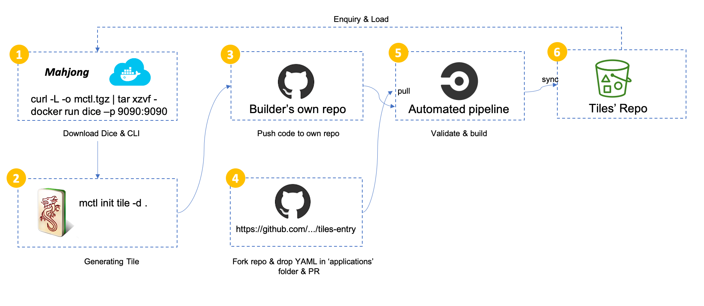

# Tiles Entry
Application for release Tile.

## Publish process

## Application for Tile 

1. Fork this [repo](https://github.com/cc4i/tiles-entry.git).

2. Drop your entry file to ['applications'](./applications) folder. The name of entry file should follow convetion : !!! GitHub_USER.yaml !!!

3. Fire a PR for further process, it'll be uploaded to Tiles' Repo automatically once get approved.
